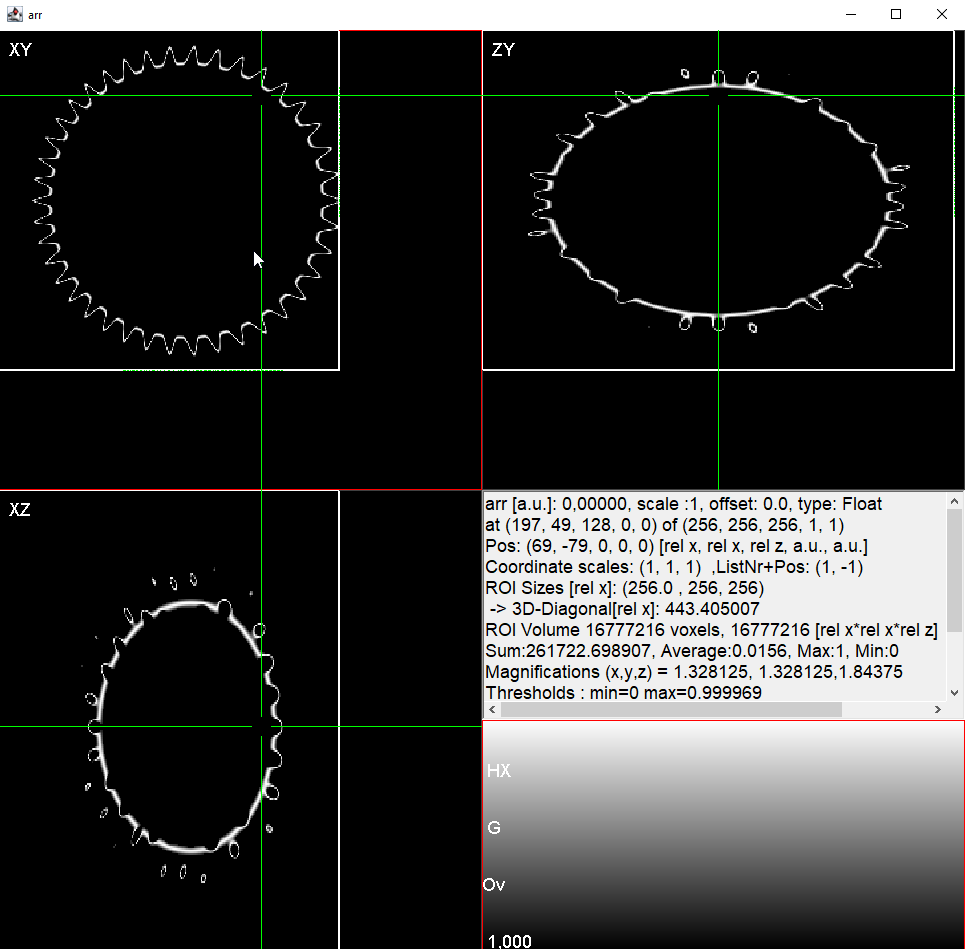
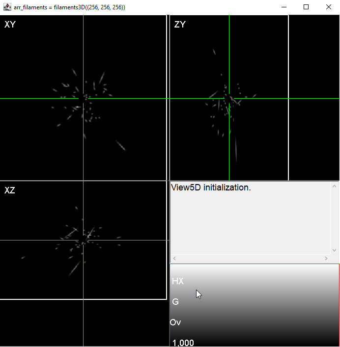
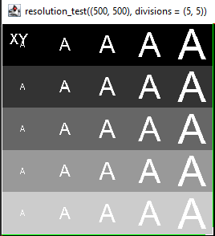

# SyntheticObjects.jl


This package creates several synthetic objects in Julia to further process in the image processing routines.

## Overview
Using this package, user can generate different objetcs for the pupose of image processing. This package contains 2D as well as 3D samples
of different objects (Numbers, Alphabets, and objects).


## Installation
`SyntheticObjects.jl` can be installed using the command:

```julia
julia> ] add SyntheticObjects
```


## Examples

```julia
julia> using SyntheticObjects

# this generates a pollen grain object array
arr_pollen = pollen3D((256, 256, 256));


# a set of filaments in 3D:
arr_filaments = filaments3D((256,256,256))

# and so on ...     
```
### Image of the pollen object (plotted using [`View5D.jl`](https://github.com/RainerHeintzmann/View5D.jl) package)


### Image of the filaments (plotted using [`View5D.jl`](https://github.com/RainerHeintzmann/View5D.jl) package)



### Image of the resolution test (plotted using [`View5D.jl`](https://github.com/RainerHeintzmann/View5D.jl) package)

